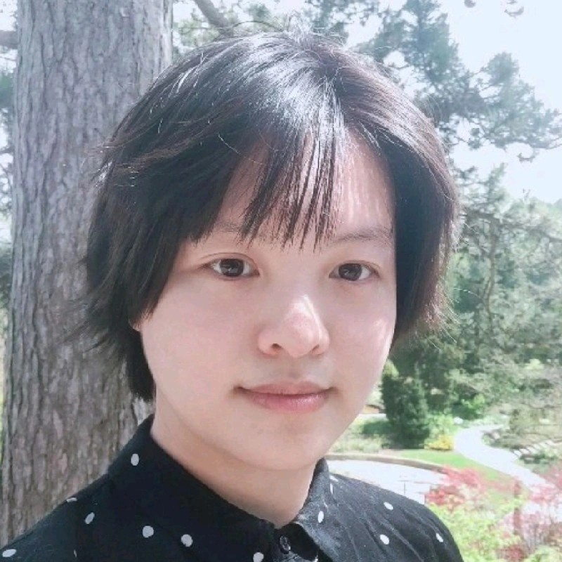

## My Story

:::: {style="display: flex; align-items: flex-start; gap: 20px;"}
::: {style="flex: 1;"}
My name is Anna Ly, and I am currently pursuing a Master of Science in Statistics at McMaster University. I am honored to be a recipient of the Ontario Graduate Scholarship, the Milos Novotny Fellowship, and the Ashbaugh Graduate Scholarship. I finished my undergraduate studies at the University of Toronto.

Since childhood, I have always been interested in probability and data visualization. I vividly recall the excitement of using crayons to colour bar plots, and that is when I knew statistics and I were a dynamic duo.
:::

::::

I also challenged my family's love for lotteries. Even back then, I had a sense of the gambler's fallacy and understood that casinos were not in the business of giving money away, but I could not prove it.

As an undergraduate student, I have received the privilege to be a teaching assistant for an introductory probability course. I shared how to compute probabilities and expected values of winning a Lotto 649 jackpot. Unfortunately, I still can't convince my father. :)

I love studying statistics because it allows me to comprehend the results of many studies without being an expert! Unlike previous generations, we live in a world where data and information are easily accessible, yet opinions formed without statistical evidence prevail. Conversely, I shape my perspectives similarly to a Bayesian model: I maintain prior beliefs but am always eager to adapt and refine them in the face of compelling evidence.

I am passionate about teaching statistics because I recognize the importance of a supportive teaching assistant. I've always been inspired by those who guide their students with understanding and without judgment. I am deeply grateful for the effective educators who have positively influenced my academic journey.

Some of you may wonder why I decided to pursue McMaster for graduate school instead of UofT, or a more prestigious school. I was actually born at the McMaster Children's Hospital. I knew from the womb that I needed to return to my birth of origin. I wanted to return so quickly I visited during my teenage years and was locked up in the mental health ward. More importantly, I wanted to have an [academically pure bloodline](https://link.springer.com/article/10.1007/s12564-015-9391-8).

## Master's Thesis Topic

I will be working on computing the Pitman closeness criterion for type-II hybrid censored data from the exponential distribution.

## Where to Find Me

If you try to search for my name, you'll have a rough time finding me. There's even another "Anna Ly" in my extended family... There were multiple Anna Ly's at the University of Toronto. Sometimes students would email the incorrect one and be upset that I didn't respond to their email. Anyways, I could vent about this all day. Here are my actual profiles:

[Github](https://github.com/annahuynhly) \| [Linkedin](https://www.linkedin.com/in/anna-ly-statistics-specialist/) \| [Google Scholar](https://scholar.google.com/citations?user=9w41oS8AAAAJ&hl=en) \| [Stackoverflow](https://stackoverflow.com/users/20815709/annahuynhly) \| [Reddit](https://www.reddit.com/user/annahuynhly/) \| [Medium](https://medium.com/@AnnaLyStats) (personal blog)

If the username so happens to include "Huynh" in the middle (i.e., annahuynhly) then it's more likely to be me. It is a common misconception that "Huynh" is my middle name. I have no middle name; it's my mom's last name.

## Fun Facts About Me

In this section you'll learn that I have a life outside of studying and teaching statistics. (The horror, I know.)

-   I grew up in Niagara Falls, Canada. From my parent's house, it takes only 45 minutes to walk to the falls. People say I'm lucky to have easy access to the magnificent falls but I've spent more time looking at that waterfall than studying statistics; it's become an eyesore to me.

-   I personally identify as Vietnamese Canadian as its the language my parents speak at home, although my ethnic background is complicated (and I'd rather not elaborate). I do not speak Vietnamese. Growing up, my parents were often working multiple jobs, so I mostly picked up language and communication through television.

-   I used to doodle all of the time; I hope to get back to drawing.

-   I have a very modest Pokemon card collection. (I don't play modern Pokemon though).

-   I love Mega Man, especially the Battle Network and Zero series.

    -   I own a [book that's "worth" thousands of dollars](https://www.amazon.ca/Megaman-Zero-Official-Complete-Works/dp/1897376014)... (I paid less than a hundred for it.)
    -   In an alternative timeline where I didn't go to school, I'd be interested in becoming a Megaman speed-runner.

-   I have followed a strict plant-based diet since 2019.

-   My favourite youtubers are [Catherine Klein](https://www.youtube.com/@CatherineKlein94/videos) and [Lifting Vegan Logic](https://www.youtube.com/@LiftingVeganLogic/videos).
